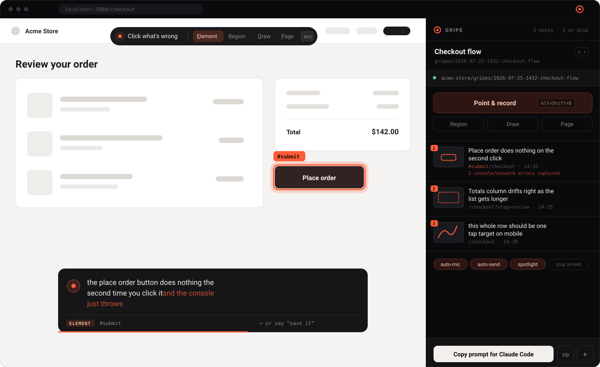

<div align="center">



# Gripe

**Point at what's broken. Say what's wrong. Hand the folder to your coding agent.**

</div>

---

Your agent just built the feature. Now you're clicking through it and a dozen things are
subtly off — this button does nothing the second time, that column drifts, this list
should be sorted. Typing all that into a chat window is slow and lossy, and you've
forgotten the first one by the time you hit the third.

Gripe turns it into a stream of consciousness:

> **hotkey → click the thing → talk → stop talking.** The note saves itself.

No Enter, no screenshot tool, no describing where the button is. Every note lands in your
repo as markdown with the screenshots, the CSS selector, the URL, and whatever the console
threw at that exact moment.

## The output

```
your-app/
└─ gripes/
   └─ 2026-07-25-1432-checkout-flow/
      ├─ report.md        ← hand this to your agent
      ├─ notes.json       ← same thing, machine-readable
      ├─ 01-full.png      ← viewport, target spotlighted
      ├─ 01-target.png    ← close-up crop, upscaled
      └─ 02-full.png
```

`report.md` is written for a model to read, not a human to skim:

```markdown
## 1. Place order does nothing on the second click

- **URL** `http://localhost:3000/checkout`
- **Time** 14:32:11
- **Element** `#submit`
- **Element text** "Place order"
- **Attributes** `data-testid="place-order"` `type="submit"`
- **Box** 412,680 · 120×40
- **Viewport** 1512×860 @2x · scrolled to 0,240


<button id="submit" class="btn btn-primary" type="submit">Place order</button>

<details><summary><b>Console / network at capture time</b> (2)</summary>

[error] TypeError: Cannot read properties of undefined (reading 'id')
        at Checkout.tsx:44
[network] 500 Internal Server Error — /api/orders

</details>
```

That last block is the sleeper feature. You point at a button; the report already contains
the `TypeError` that broke it.

Then you paste the line the panel put on your clipboard:

> Read gripes/2026-07-25-1432-checkout-flow/report.md — it's a bug report I recorded while
> clicking through the running app, with screenshots. Look at every image, then fix what's
> described.

## Install

```bash
npm install && npm run build
```

`chrome://extensions` → **Developer mode** → **Load unpacked** → pick `dist/`. Click the
icon to open the side panel, hit **Connect folder**, choose your repo. Done — Chrome
remembers the folder across restarts.

Not connecting a folder is fine too; **.zip** in the footer downloads the same thing.

## Controls

| | |
| --- | --- |
| `Alt+Shift+B` <sub>(`⌥⇧B` on macOS)</sub> | Arm the picker |
| `Alt+Shift+N` | Quick note about the whole page |
| `E` `R` `D` `P` | Element / Region / Draw / Page — or click them in the toolbar |
| *say* **"save it"** | Commit the note by voice |
| `Enter` | Commit it by hand |
| `Ctrl+Space` | Toggle the mic |
| `Alt`+click | Take the literal element, no climbing |
| `Esc` | Bail out |

The panel shows the shortcut Chrome actually bound on *your* machine — click it to rebind.

**Four ways to point.** **Element** hover-highlights DOM nodes and records the selector,
visible text, test ids, and opening tag — clicking a button's inner label gets you the
*button*, not the throwaway `<span>`. **Region** drags a box for things that aren't one
element. **Draw** scribbles arrows on the page. **Page** is just a note about what you're
looking at.

**You don't reach for the keyboard.** Dictation starts on its own and survives your pauses
(Chrome kills recognition on silence; Gripe restarts it under you). When you stop talking,
a bar drains across the composer and the note commits — keep talking, or touch a key, and
it calls it off. Or just say *"save it."*

## Sessions

Every session is kept. **▾** next to the name switches back to an old one — new notes
append and `report.md` is rewritten in place. **+** starts a fresh one. Notes recorded
while the panel is closed still land; they flush to disk when you open it.

## How it works

```
content script ──┬─ shadow-DOM overlay: picker, marquee, ink canvas, composer
                 ├─ Web Speech dictation, restarted through silences
                 └─ composites the capture: spotlight + box + strokes + crop
        │  chrome.runtime
        ▼
background SW ───┬─ chrome.tabs.captureVisibleTab (background-only API)
                 └─ IndexedDB: sessions, notes, image blobs
        │
        ▼
side panel ──────┬─ React view over that state
                 └─ File System Access: writes straight into your repo
```

The page's own `console.error`, `fetch`, and `XHR` are tapped by a 90-line MAIN-world
script that forwards events over `postMessage`; each note grabs whatever fired in the
window around it.

No runtime dependencies but React. The ZIP writer, the PNG icon generator, and the
screenshot compositor are all hand-rolled — `npm install` pulls nothing but build tools.

## Known edges

- Won't run on `chrome://` pages, the Web Store, or other extensions — Chrome forbids
  content scripts there.
- Dictation is Chrome's Web Speech API, which asks for mic permission **per site**. Grant
  it once on your dev origin. Sites that kill the mic via `Permissions-Policy` fall back
  to typing.
- Screenshots are the visible viewport, not the whole desktop — devtools and other windows
  aren't in frame.
- `gripes/` is yours to gitignore or commit. Nothing else in the folder you connect is ever
  touched.

## Develop

```bash
npm run dev        # vite --watch; reload the extension after it rebuilds
npm run typecheck
```

MIT.
